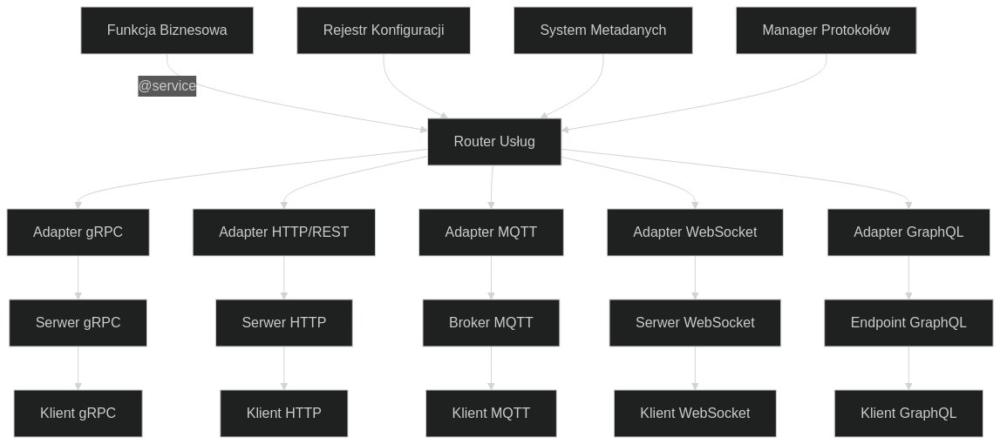

# PI func -> Protocol Interface Functions

PIfunc revolutionizes how you build networked applications by letting you **write your function once** and expose it via **multiple communication protocols simultaneously**. No duplicate code. No inconsistencies. Just clean, maintainable, protocol-agnostic code.

```python
@service(
    http={"path": "/api/calculator/add", "method": "POST"},
    mqtt={"topic": "calculator/add"},
    websocket={"event": "calculator.add"}
)
def add(a: int, b: int) -> int:
    """Adds two numbers."""
    return a + b
```

## 🚀 This simple function is now simultaneously available via:

- HTTP/REST
- gRPC
- MQTT
- WebSocket
- GraphQL

...all without writing a single line of additional code!



## 📦 Installation

Install from PyPI:

```bash
pip install pifunc
```

Or install with specific protocol support:

```bash
pip install pifunc[http,mqtt,websocket]
```

## 🏁 Quick Start

1. Create a file `calculator.py`:

```python
from pifunc import service, run_services

@service()
def add(a: int, b: int) -> int:
    """Adds two numbers."""
    return a + b

@service()
def subtract(a: int, b: int) -> int:
    """Subtracts b from a."""
    return a - b

if __name__ == "__main__":
    run_services(
        grpc={"port": 50051},
        http={"port": 8080},
        watch=True  # Auto-reload on file changes
    )
```

2. Run your service:

```bash
python calculator.py
```

3. Call your functions via HTTP:

```bash

^C
sleep 2 && curl -X POST -H "Content-Type: application/json" -d '{"a": 5, "b": 3}' http://localhost:8080/api/__main__/add

`curl -X POST http://localhost:8080/api/add -H "Content-Type: application/json" -d '{"a": 5, "b": 3}'`
# {"result": 8}
```

4. Or use the CLI:

```bash
pifunc call add --protocol http --args '{"a": 5, "b": 3}'
# 8
```

## ✨ Features

- **Multi-Protocol Support**: Expose functions via HTTP/REST, gRPC, MQTT, WebSocket, and GraphQL
- **Zero Boilerplate**: Single decorator approach with sensible defaults
- **Type Safety**: Automatic type validation and conversion
- **Hot Reload**: Instant updates during development
- **Protocol-Specific Configurations**: Fine-tune each protocol interface
- **Automatic Documentation**: OpenAPI, gRPC reflection, and GraphQL introspection
- **Comprehensive CLI**: Manage and test your services with ease
- **Monitoring & Health Checks**: Built-in observability
- **Enterprise-Ready**: Authentication, authorization, and middleware support

## 🔌 Supported Protocols

| Protocol | Description | Best For |
|----------|-------------|----------|
| **HTTP/REST** | RESTful API with JSON | Web clients, general API access |
| **gRPC** | High-performance RPC | Microservices, performance-critical systems |
| **MQTT** | Lightweight pub/sub | IoT devices, mobile apps |
| **WebSocket** | Bidirectional comms | Real-time applications, chat |
| **GraphQL** | Query language | Flexible data requirements |

## 📚 Examples

### Advanced Configuration

```python
@service(
    # HTTP configuration
    http={
        "path": "/api/users/{user_id}",
        "method": "GET",
        "middleware": [auth_middleware, logging_middleware]
    },
    # MQTT configuration
    mqtt={
        "topic": "users/get",
        "qos": 1,
        "retain": False
    },
    # WebSocket configuration
    websocket={
        "event": "user.get",
        "namespace": "/users"
    },
    # GraphQL configuration
    graphql={
        "field_name": "user",
        "description": "Get user by ID"
    }
)
def get_user(user_id: str) -> Dict:
    """Get user details by ID."""
    return db.get_user(user_id)
```

### Streaming Data

```python
@service(
    grpc={"streaming": True},
    websocket={"event": "monitoring.metrics"}
)
async def stream_metrics(interval: int = 1):
    """Stream system metrics."""
    while True:
        metrics = get_system_metrics()
        yield metrics
        await asyncio.sleep(interval)
```

### Working with Complex Types

```python
@dataclass
class Product:
    id: str
    name: str
    price: float
    in_stock: bool

@service()
def create_product(product: Product) -> Product:
    """Create a new product."""
    # PIfunc automatically converts JSON to your dataclass
    product.id = generate_id()
    db.save_product(product)
    return product
```

## 🛠️ CLI Usage

PIfunc includes a powerful CLI for managing and interacting with your services:

```bash
# Start a service
pifunc serve calculator.py

# Generate client code
pifunc generate client --language typescript --protocols http,websocket

# Call a function
pifunc call add --protocol http --args '{"a": 5, "b": 3}'

# View service documentation
pifunc docs --output ./docs

# Run a benchmark
pifunc benchmark add --protocol grpc --iterations 1000 --concurrency 10
```

## 📖 Documentation

Comprehensive documentation is available at [https://www.pifunc.com/docs](https://www.pifunc.com/docs)

- [API Reference](https://www.pifunc.com/docs/api-reference)
- [Protocol Configurations](https://www.pifunc.com/docs/protocols)
- [Advanced Usage](https://www.pifunc.com/docs/advanced)
- [Deployment Guide](https://www.pifunc.com/docs/deployment)
- [Extending PIfunc](https://www.pifunc.com/docs/extending)

## 🤝 Contributing

Contributions are welcome! See [CONTRIBUTING.md](CONTRIBUTING.md) for how to get started.

1. Fork the repository
2. Create your feature branch (`git checkout -b feature/amazing-feature`)
3. Commit your changes (`git commit -m 'Add some amazing feature'`)
4. Push to the branch (`git push origin feature/amazing-feature`)
5. Open a Pull Request

## 📄 License

PIfunc is licensed under the Apache License 2.0. See [LICENSE](LICENSE) for details.


Generate directory structures from ASCII art or Markdown files.

+ [CONTRIBUTION.md](CONTRIBUTION.md)

## Development


### Setting up a virtual environment

Create a virtual environment

```bash
python -m venv venv
```

```bash
source venv/bin/activate
```

```bash
pip install --upgrade pip
pip install -r requirements.txt
```

```bash
pip install -e .
```


---

<div align="center">
  
  <h1>PIfunc</h1>
  <p><strong>Protocol Interface Functions</strong></p>
  <p>One function, every protocol. Everywhere.</p>
  
  <p>
    <a href="#installation"><strong>Installation</strong></a> •
    <a href="#quick-start"><strong>Quick Start</strong></a> •
    <a href="#features"><strong>Features</strong></a> •
    <a href="#examples"><strong>Examples</strong></a> •
    <a href="#documentation"><strong>Documentation</strong></a> •
    <a href="#contributing"><strong>Contributing</strong></a> •
    <a href="#license"><strong>License</strong></a>
  </p>
  
  <p>
    <a href="https://github.com/pifunc/pifunc/actions">
      
    </a>
    <a href="https://pypi.org/project/pifunc/">
      
    </a>
    <a href="https://pepy.tech/project/pifunc">
      
    </a>
    <a href="https://github.com/pifunc/pifunc/blob/main/LICENSE">
      
    </a>
    <a href="https://discord.gg/pifunc">
      
    </a>
  </p>
</div>


---

---

---

<div align="center">
  <p>Built with ❤️ by the PIfunc team and contributors</p>
  <p>
    <a href="https://www.pifunc.com">Website</a> •
    <a href="https://twitter.com/pifunc">Twitter</a> •
    <a href="https://discord.gg/pifunc">Discord</a>
  </p>
</div>